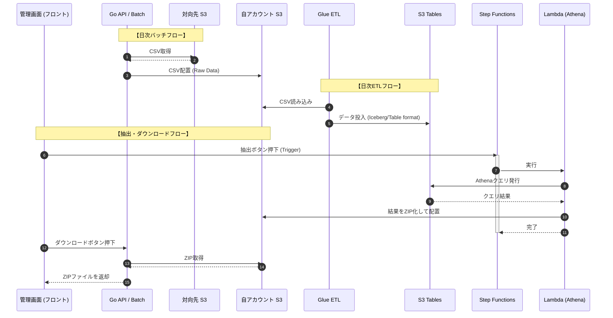

# S3 Tables×Glue×Athenaで構築するETL

## ETLとは？

## 構成

## 主要サービス

- Glue
  - フルマネージド型のデータ統合サービスで、主な機能としてはデータの抽出・変換・ロード
  - 利用者側としてはPythonスクリプト(SQLやDataFrame API)を書くだけ
  - 内部的な話
    - 内部では、分散処理フレームワークであるSpark（オープンソース/複数のノードがクラスタとして動作し、インメモリで処理される＝高速で大量のデータを分散処理するやつ）が動いている
    - SparkはScalaで書かれているのでJVMで実行される
    - 処理の流れは、Pythonスクリプトが実行される→DriverによってPythonスクリプトが解釈され実行計画を立てて各ノードを起動→複数のノードでデータの分散処理を行う
  - 端的にいうと**「あらゆる形式のデータソースから、高速＆楽にデータを変換＆格納することができる」**

- S3 Tables
  - 2024年に発表されたS3のテーブルバケット形式
    - 中身自体は普通のS3バケットと同じくオブジェクトだが、データファイル(.parque)とメタデータファイルをマネージドで管理することによって、DBっぽく振る舞うことができる
  - オープンテーブルフォーマットのApache Icebergをフルマネージドでサポート
  - データカタログ機能が統合されており、メタデータ管理を簡素化
  - 端的にいうと**「格納されたデータをDBっぽく見せることができるマネージドなサービスで、それを実現するためにどれが最新のデータかどこにデータがあるかなどのメタデータ情報を持っている」**

- Athena
  - S3上のデータに対し、標準SQLで直接クエリを実行できるサーバーレス環境
  - Glueデータカタログと連携し、S3 Tablesなどの構造化データを即座に分析可能
  - インフラ構築不要で、クエリ結果をそのままS3へ出力
  - 読み取ったデータ量に基づく従量課金モデル
