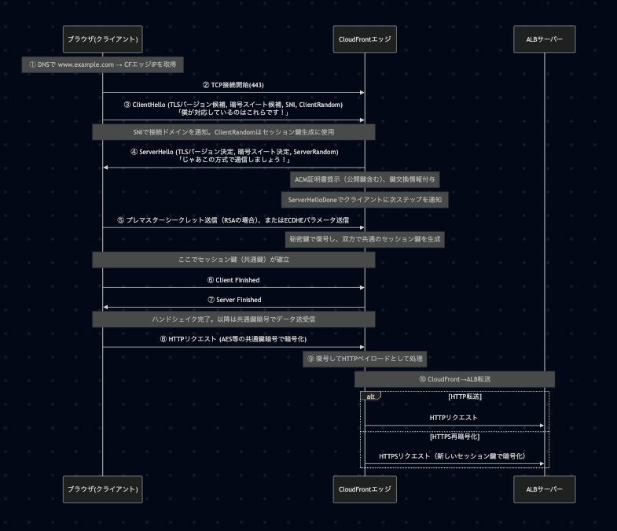

# HTTPS

## HTTPS通信の流れ

## SSL証明書の種類

- ドメイン認証(DV)
  - CAが申請者がドメイン管理者であることのみを確認する
    - ACMでのCNAMEレコードを用いた認証はこれに該当する
- 組織認証(OV)
  - CAは合法的な存在であることを確認する
- 拡張検証(EV)
  - CAは厳格な検証プロセスを通じて組織を確認する
  - ブラウザのアドレスバーが緑色になる