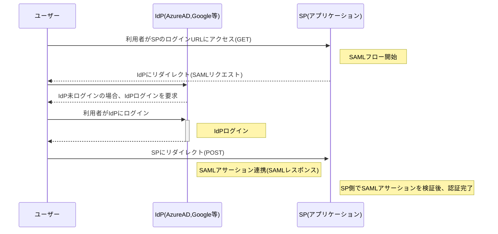

# SAML

## 概要

- Security Assertion Markup Languageの略
- 異なるドメイン間でユーザー認証を実現するXMLベースの標準規格
    - 異なるドメイン間で認証に関する情報をXML文書でやり取りするためのルール
        - プラメクーポンの例：プラメクーポン(管理画面)とAzureAD間で認証情報をXMLでやり取りしています
- 2002年に策定、2005年に2.0がリリースされている
    - 現在は2.0が主流

## 処理の流れ

### 登場人物

- クライアント
    - 認証させたいアプリケーション
    - 大体は私たちが開発しているアプリケーションを指す
- IdP
    - Identity Providerの略
    - 認証機能を提供するサービス
    - 具体的にはGoogleやAzureAD,Okta等が該当する
- SP
    - Service Providerの略
    - ユーザーが利用するサービス
    - 大体は私たちが開発しているアプリケーションを利用するユーザーを指す

### フロー

## 認証フローの種類

- SAMLの認証フローは2種類ある
1. SP initiated SSO
    - SP→IdPにアクセスする
    - 例：アプリケーションのログイン画面にメールアドレスを入力し、Googleリダイレクト→Googleログインを経由し、アプリケーションにログインする
2. IdP initiated SSO
    - IdP→SPにアクセスする
    - Googleトップ画面やAzureADのアプリ一覧に表示されているアプリケーションを選択し、アプリケーションにログインする

※SSO＝シングルサインオン

※起点が異なるだけで、基本的にやっていることは同じ

## SAMLが解決していること

- 利便性の向上
    - 1サービスへのログインで複数サービスへの利用が可能(シングルサインオン)
- セキュリティ性の向上
    - ユーザー的には複数のIDパスワードを管理しなくて良くなる
    - アプリケーション的には、自前で認証機能を持たなくて良くなる
        - 開発工数も削減できる
